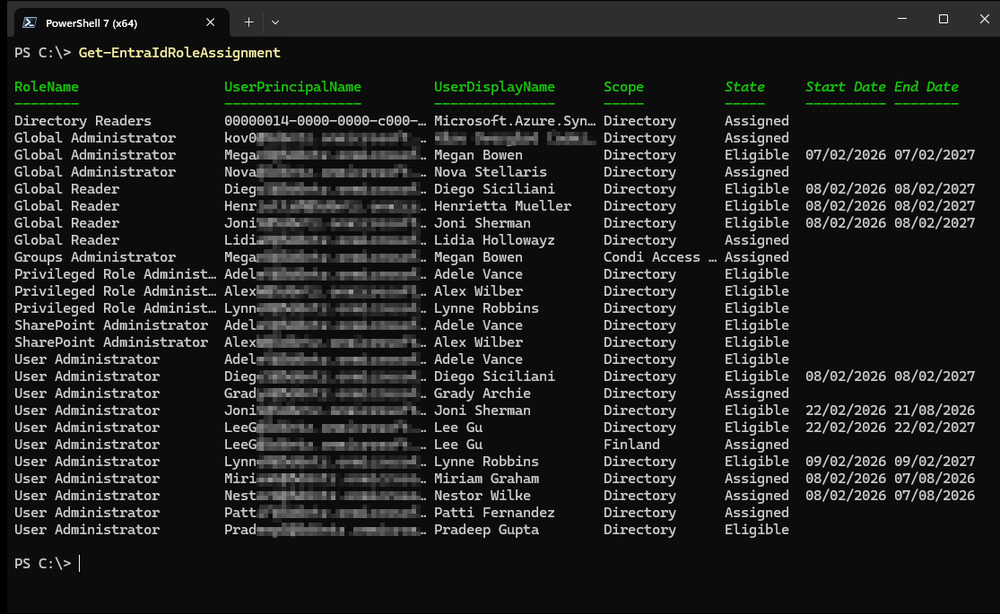
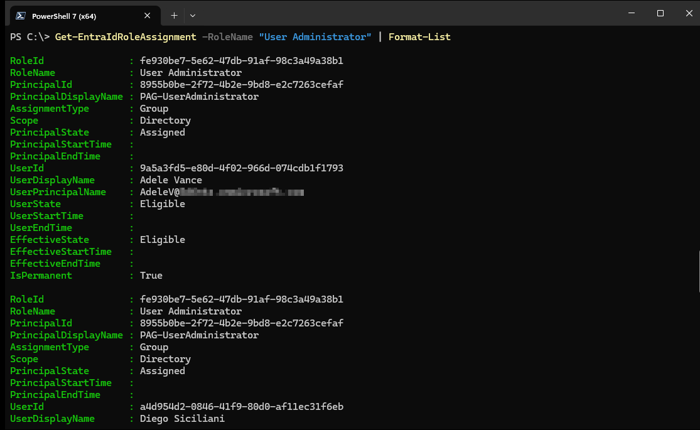

# EntraReporter

EntraReporter is a PowerShell module designed to report on information from Entra ID (Azure Active Directory), including role assignments and eligibility schedules. It leverages Microsoft Graph API to provide detailed insights into privileged access management (PAM) configurations, including role assignments for users, groups, and service principals. The module is particularly useful for compliance auditing, security reviews, and administrative reporting.

Key features include:
- Comprehensive role assignment reporting with effective date ranges, with support for group-based role assignments and eligibility
- License level detection for Entra ID tiers
- Batch processing for efficient API calls
- Detailed output with customizable formatting

## Installation

To install the module, run:

```powershell
Install-Module -Name 'EntraReporter' -Scope CurrentUser
```

Alternatively, clone the repository and import the module manually:

```powershell
git clone https://github.com/kovergard/EntraReporter.git
cd EntraReporter
Import-Module .\EntraReporter\EntraReporter.psd1
```

## Functions

### Get-EntraIdRoleAssignment

**Description:**  
This cmdlet queries Entra ID role assignments and eligibility information for users, groups, and service principals. The function queries Microsoft Graph Privileged Identity Management (PIM) APIs to consolidate role schedules into a unified report, resolving group memberships and calculating effective assignment windows.

**Parameters:**
- `RoleName` (optional): Filter by one or more role names (e.g., 'Global Administrator', 'User Administrator').

**Output:**  
Returns a collection of PSCustomObjects with properties including RoleId, RoleName, PrincipalId, AssignmentType, Scope, EffectiveState, EffectiveStartTime, EffectiveEndTime, and more.

**Examples:**

1. **Retrieve all role assignments and eligibilities:**
   ```powershell
   Get-EntraIdRoleAssignment
   ```
   This command fetches all role assignments in the tenant, and shows the most important properties.  
   

2. **Filter by specific role with all details:**
   ```powershell
   Get-EntraIdRoleAssignment -RoleName "User Administrator" | Format-List
   ```
   This retrieves assignments only for the 'User Administrator' role, and show all returned properties.
   

**Notes:**  
Requires Entra P2 license level. Ensure you have connected to Microsoft Graph with appropriate scopes (e.g., `Connect-MgGraph -Scopes 'RoleEligibilitySchedule.Read.Directory','PrivilegedEligibilitySchedule.Read.AzureADGroup', 'PrivilegedAssignmentSchedule.Read.AzureADGroup'`).

### Get-EntraIdLevel

**Description:**  
Determines the Entra ID license level (Free, P1, or P2) for the connected tenant by querying subscribed SKUs via Microsoft Graph.

**Parameters:**
- `IncludeDetails` (switch): Includes detailed license counts and SKU part numbers.

**Output:**  
PSCustomObject with Level, IsP1Available, IsP2Available, and optionally detailed counts.

**Example:**
```powershell
Get-EntraIdLevel -IncludeDetails
```
Output example:
```
Level         : P2
IsP1Available : True
IsP2Available : True
P1EnabledCount: 50
P2EnabledCount: 25
P1AssignedCount: 45
P2AssignedCount: 20
P1SkuPartNumbers: {AAD_PREMIUM}
P2SkuPartNumbers: {AAD_PREMIUM_P2}
```

### Other Functions

- **Get-EntraIdGroupScheduleBatch:** Retrieves group membership schedules in batches for efficiency.
- **Get-AdministrativeUnit:** Internal function for resolving administrative unit names.
- **Invoke-GraphBatch / Invoke-GraphPaged:** Internal utilities for Graph API calls.

## Contributing

Contributions are welcome! Please submit issues and pull requests on GitHub.

## License

This project is licensed under the MIT License - see the LICENSE file for details.
